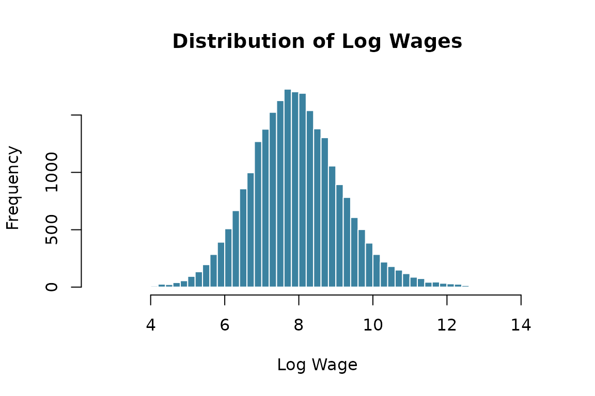

# Analyzing a Simulated Labor Market

## Goal

This vignette walks through a complete analysis of a simulated labor
market: simulate the data, explore it, estimate an AKM model, decompose
wage variance, and correct for limited mobility bias.

## 1. Simulate the Data

We simulate a labor market with 5,000 workers observed over 5 periods,
with moderate mobility (`lambda = 0.15`) and a Mincer wage equation:

``` r
library(labormarket)
library(data.table)

set.seed(2024)
lm_obj <- simlabormarket(
  nk = 4,       # 4 firm types
  nl = 5,       # 5 worker types
  nt = 5,       # 5 time periods
  ni = 5000,    # 5,000 workers
  lambda = 0.15, # 15% moving probability
  ratiog = 0.45, # 45% female
  mincer = TRUE   # Mincer wage equation
)
#> -- LaborMarket simulation ---
#> 
#>   Parameters
#>     Firm types (nk):     4 
#>     Worker types (nl):   5 
#>     Time periods (nt):   5 
#>     Individuals (ni):    5000 
#>     Female ratio:        0.45 
#>     Mobility (lambda):   0.15 
#> 
#>   Summary statistics
#>     Observations:        25000 
#>     Mean wage:           7.931 
#>     Mean firm effect:    2.554 
#>     Mean worker effect:  4.144 
#>     Mean age:            38.7 
#>     Mean education:      16.1 
#>     Mean experience:     12.1

panel <- lm_obj@panel
```

## 2. Explore the Panel

### Dimensions

``` r
cat("Observations:", nrow(panel), "\n")
#> Observations: 25000
cat("Workers:", length(unique(panel$i)), "\n")
#> Workers: 5000
cat("Firms:", length(unique(panel$fid)), "\n")
#> Firms: 998
cat("Periods:", length(unique(panel$t)), "\n")
#> Periods: 5
```

### Summary Statistics

``` r
# Wage and key variables
summary_vars <- panel[, .(
  mean_wage  = mean(lw),
  sd_wage    = sd(lw),
  mean_age   = mean(age),
  mean_educ  = mean(educ),
  mean_exper = mean(experience),
  pct_female = mean(gender)
)]
t(summary_vars)
#>                 [,1]
#> mean_wage   7.930652
#> sd_wage     1.250121
#> mean_age   38.714200
#> mean_educ  16.113800
#> mean_exper 12.123640
#> pct_female  0.457000
```

### Wage Distribution

``` r
hist(panel$lw, breaks = 50, col = "#3B82A0", border = "white",
     main = "Distribution of Log Wages", xlab = "Log Wage")
```



### Gender Wage Gap

``` r
panel[, .(mean_wage = mean(lw), n = .N), by = gender]
#>    gender mean_wage     n
#>     <num>     <num> <int>
#> 1:      0  7.960131 13575
#> 2:      1  7.895626 11425
```

### Movers vs Stayers

``` r
# A mover is someone who changes fid across periods
movers <- panel[, .(n_firms = length(unique(fid))), by = i]
movers[, mover := n_firms > 1]
cat("Movers:", sum(movers$mover), "/", nrow(movers),
    "(", round(100 * mean(movers$mover), 1), "%)\n")
#> Movers: 2440 / 5000 ( 48.8 %)
```

## 3. Estimate the AKM Model

We estimate the classic Abowd, Kramarz, and Margolis (1999) two-way
fixed effects decomposition:

$$\log w_{it} = \alpha_{i} + \psi_{j{(i,t)}} + \varepsilon_{it}$$

``` r
library(fixest)

panel$fid_f <- as.factor(panel$fid)
panel$i_f   <- as.factor(panel$i)

# Restrict to the largest connected set
cf <- lfe::compfactor(list(panel$i_f, panel$fid_f))
largest <- names(which.max(table(cf)))
panel_conn <- panel[cf == largest]
panel_conn[, i_f   := droplevels(i_f)]
panel_conn[, fid_f := droplevels(fid_f)]

cat("Observations in connected set:", nrow(panel_conn), "/", nrow(panel), "\n")
#> Observations in connected set: 24970 / 25000

# Estimate
model <- feols(lw ~ 1 | i_f + fid_f, data = panel_conn)
#> NOTE: 0/1 fixed-effect singleton was removed (1 observation).
summary(model)
#> OLS estimation, Dep. Var.: lw
#> Observations: 24,969
#> Fixed-effects: i_f: 4,994,  fid_f: 994
#> RMSE: 0.873302   Adj. R2: 0.35829
```

### Extract Fixed Effects

``` r
fe <- fixef(model)
alpha_hat <- fe$i_f     # worker effects
psi_hat   <- fe$fid_f   # firm effects

cat("Worker effects — mean:", round(mean(alpha_hat), 3),
    " sd:", round(sd(alpha_hat), 3), "\n")
#> Worker effects — mean: 8.25  sd: 0.814
cat("Firm effects   — mean:", round(mean(psi_hat), 3),
    " sd:", round(sd(psi_hat), 3), "\n")
#> Firm effects   — mean: -0.311  sd: 0.764
```

## 4. Variance Decomposition

The variance of log wages decomposes as:

$$\text{Var}\left( \log w \right) = \text{Var}\left( \widehat{\alpha} \right) + \text{Var}\left( \widehat{\psi} \right) + 2\,\text{Cov}\left( \widehat{\alpha},\widehat{\psi} \right) + \text{Var}\left( \widehat{\varepsilon} \right)$$

``` r
# Match FEs back to observations
fe_list <- fixef(model)
# Use fixef_id to map observations to fixed effects (handles singletons)
alpha_vec <- fe_list$i_f[model$fixef_id$i_f]
psi_vec   <- fe_list$fid_f[model$fixef_id$fid_f]

# Subset to model observations if singletons were removed
obs_rm <- model$obs_selection$obsRemoved
if (!is.null(obs_rm)) {
  panel_conn <- panel_conn[obs_rm]  # negative indices = rows to drop
}

panel_conn[, alpha_hat := alpha_vec]
panel_conn[, psi_hat   := psi_vec]
panel_conn[, resid     := lw - alpha_hat - psi_hat]

var_wage  <- var(panel_conn$lw)
var_alpha <- var(panel_conn$alpha_hat)
var_psi   <- var(panel_conn$psi_hat)
cov_ap    <- cov(panel_conn$alpha_hat, panel_conn$psi_hat)
var_resid <- var(panel_conn$resid)

decomp <- data.frame(
  Component = c("Var(alpha)", "Var(psi)", "2*Cov(alpha,psi)", "Var(residual)", "Total"),
  Value = round(c(var_alpha, var_psi, 2 * cov_ap, var_resid, var_wage), 4),
  Share = round(c(var_alpha, var_psi, 2 * cov_ap, var_resid, var_wage) / var_wage * 100, 1)
)
decomp
#>          Component  Value Share
#> 1       Var(alpha) 0.6628  42.4
#> 2         Var(psi) 0.5686  36.4
#> 3 2*Cov(alpha,psi) 0.0222   1.4
#> 4    Var(residual) 1.9142 122.4
#> 5            Total 1.5633 100.0
```

### Worker–Firm Sorting

``` r
cor_ap <- cor(panel_conn$alpha_hat, panel_conn$psi_hat)
cat("Correlation(alpha, psi):", round(cor_ap, 3), "\n")
#> Correlation(alpha, psi): 0.018
```

A positive correlation indicates assortative matching — high-type
workers sort into high-paying firms.

## 5. Correct Limited Mobility Bias

The variance decomposition above is **biased** when firms have few
movers. We use
[`lmbias()`](https://hugosantanna.github.io/labormarket/reference/lmbias.md)
to correct this:

``` r
panel_conn$xbeta <- 0  # intercept-only model

results <- lmbias(model, panel_conn, R = 50)
print(round(results, 4))
#>           Var of i_f Var of fid_f Covariance Correlation
#> Original      0.6628       0.5686     0.0111      0.0181
#> Bias          0.2896       0.1646    -0.1376     -0.6305
#> Corrected     0.3732       0.4040     0.1487      0.6485
```

### Interpretation

``` r
cat("--- Variance of Worker Effects ---\n")
#> --- Variance of Worker Effects ---
cat("  Original: ", round(results["Original", 1], 4), "\n")
#>   Original:  0.6628
cat("  Bias:     ", round(results["Bias", 1], 4), "\n")
#>   Bias:      0.2896
cat("  Corrected:", round(results["Corrected", 1], 4), "\n\n")
#>   Corrected: 0.3732

cat("--- Variance of Firm Effects ---\n")
#> --- Variance of Firm Effects ---
cat("  Original: ", round(results["Original", 2], 4), "\n")
#>   Original:  0.5686
cat("  Bias:     ", round(results["Bias", 2], 4), "\n")
#>   Bias:      0.1646
cat("  Corrected:", round(results["Corrected", 2], 4), "\n\n")
#>   Corrected: 0.404

cat("--- Correlation ---\n")
#> --- Correlation ---
cat("  Original: ", round(results["Original", 4], 4), "\n")
#>   Original:  0.0181
cat("  Corrected:", round(results["Corrected", 4], 4), "\n")
#>   Corrected: 0.6485
```

The bias correction typically **reduces** the estimated variance of both
worker and firm effects (since limited mobility inflates them) and can
meaningfully change the estimated sorting correlation.

## Summary

| Step     | Function                                                                                     | What it does                                   |
|----------|----------------------------------------------------------------------------------------------|------------------------------------------------|
| Simulate | [`simlabormarket()`](https://hugosantanna.github.io/labormarket/reference/simlabormarket.md) | Generate worker-firm panel with known DGP      |
| Estimate | [`fixest::feols()`](https://lrberge.github.io/fixest/reference/feols.html)                   | Two-way FE (AKM) decomposition                 |
| Correct  | [`lmbias()`](https://hugosantanna.github.io/labormarket/reference/lmbias.md)                 | Bootstrap bias correction for limited mobility |

This workflow lets you study how parameters like mobility (`lambda`),
number of firm types (`nk`), and sample size (`ni`) affect the magnitude
of limited mobility bias — a key concern in empirical labor economics.
